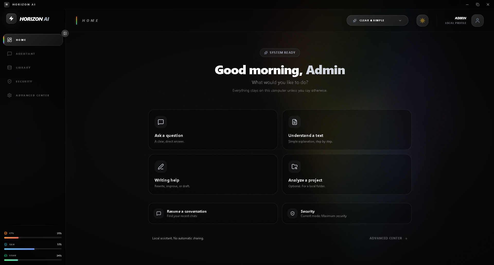
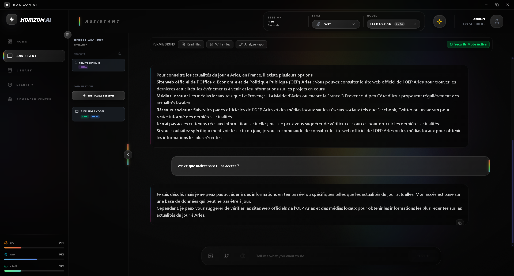
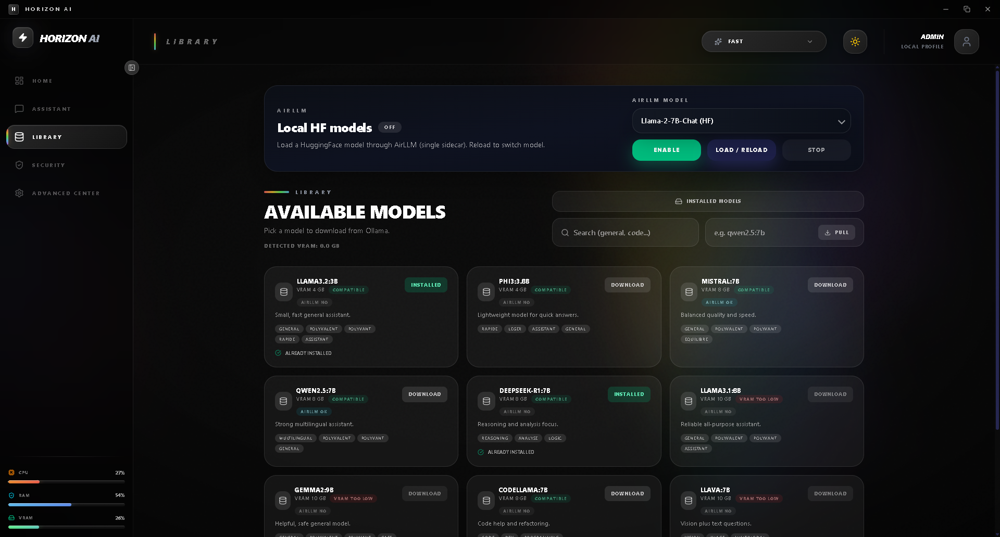
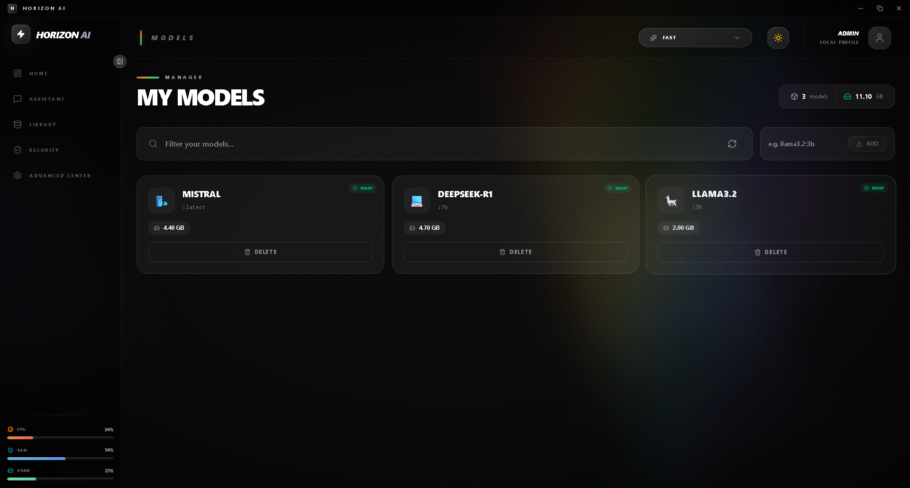

# 🚀 Horizon AI

**Horizon AI** is a modern desktop application that provides a **unified interface for multiple AI models**, both **local and cloud-based**, with a strong focus on **performance, modularity, and user control**.

The project is built to be **extensible by design**, allowing new AI providers, models, and execution backends to be added without breaking the existing architecture.

---

## ✨ Key Features

- 🧠 **Multi-provider AI support**
  - Ollama (local GGUF models)
  - AirLLM (VRAM-optimized Hugging Face models)
  - Cloud APIs (Claude, OpenAI – optional)
- 🔁 **Unified provider router**
- 🖥️ **Desktop application**
- ⚙️ **Manual provider activation**
- 📦 **Model selection & lifecycle management**
- 🚦 **Real-time provider status**
- 🧩 **Modular & scalable architecture**
- 💾 **Persistent configuration**
- 🔒 **Offline-first** with local models

---

## 🧱 Tech Stack

### Frontend
- ⚛️ React
- ⚡ Vite
- 🎨 TailwindCSS
- 🖥️ Tauri

### Backend
- 🧵 Worker-based backend (Node / TypeScript)
- 🔌 Provider routing system
- 🐍 Python sidecar (AirLLM)

### AI / Providers
- Ollama → Local GGUF models
- AirLLM → Hugging Face models with optimized VRAM usage
- Cloud APIs → Claude / OpenAI (optional)

---

## 🏗️ Project Architecture

```
Horizon AI
│
├── frontend/               # React + Tailwind UI
│
├── backend/
│   ├── worker/             # Core backend worker
│   │   ├── providers/
│   │   ├── managers/
│   │   └── router/
│   │
│   └── sidecars/
│       └── airllm_sidecar.py
│
├── screenshots/            # Application screenshots
│
└── config.json             # Persistent configuration
```

---

## 🧠 Supported Providers

### ✅ Ollama
- Local GGUF models
- Fast startup
- Low latency
- Ideal for daily usage

### ✅ AirLLM
- Manually enabled
- VRAM-efficient loading
- User-selected models
- Start / stop on demand
- Single-instance execution (GPU safety)

### ☁️ Cloud Providers (Optional)
- Claude
- OpenAI
- Any OpenAI-compatible API

---

## ⚙️ Provider Lifecycle

Each provider can be:
- Enabled / Disabled
- Loaded / Unloaded
- Selected at runtime

### Provider States
- `OFF`
- `LOADING`
- `READY`
- `ERROR`

---

## 🖥️ Application Screenshots

> Place your screenshots inside the `screenshots/` folder at the project root.

### 🏠 Main Interface
```md

```

### 🔌 Provider Selection
```md

```

### 🧠 Model Selection (AirLLM)
```md

```

### ⏳ Model Loading
```md

```

### 💬 Chat Interface
```md

```

---

## 🚀 Getting Started

### Prerequisites
- Node.js
- Python 3.9+
- Ollama installed
- CUDA-compatible GPU recommended (for AirLLM)

### Install dependencies
```bash
npm install
```

### Run in development
```bash
npm run dev
```

### Build desktop application
```bash
npm run build
```

---

## 🧠 Design Philosophy

- Explicit user control
- No forced providers
- No hidden background services
- Clear model lifecycle
- Clean separation of concerns
- Extensible without refactoring

---

## 🛣️ Roadmap

- Streaming responses
- Advanced routing rules
- Conversation memory
- Plugin system
- Model benchmarking
- Additional providers

---

## 🤝 Contributing

Contributions are welcome.

- Keep changes modular
- Do not break existing providers
- Follow existing project structure
- Document new providers

---

## 🧑‍💻 Author

**Gabriel (Horizon)**

---

> Horizon AI — *One interface. Multiple intelligences.*
