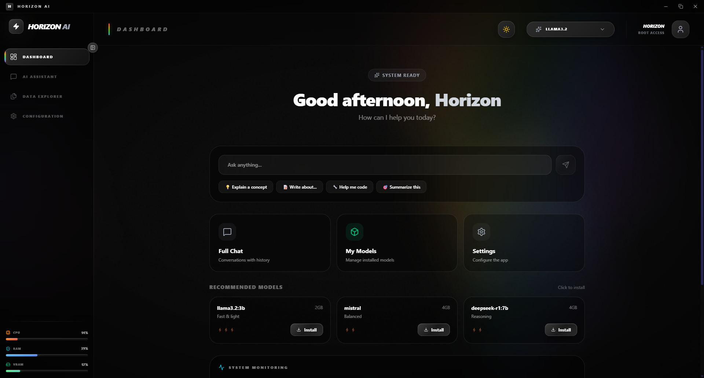
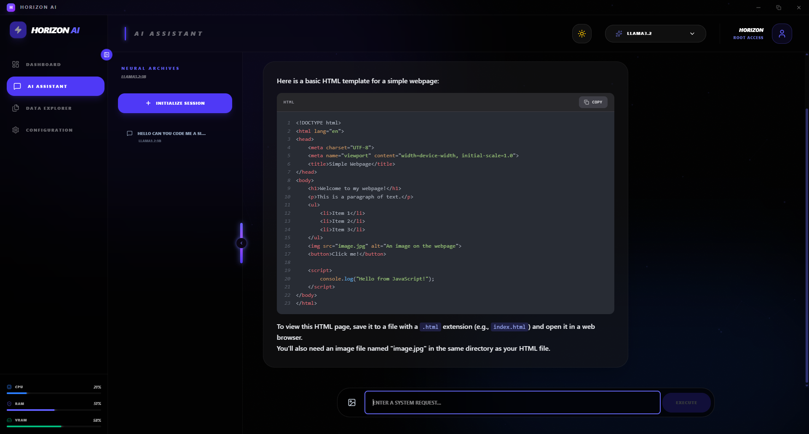
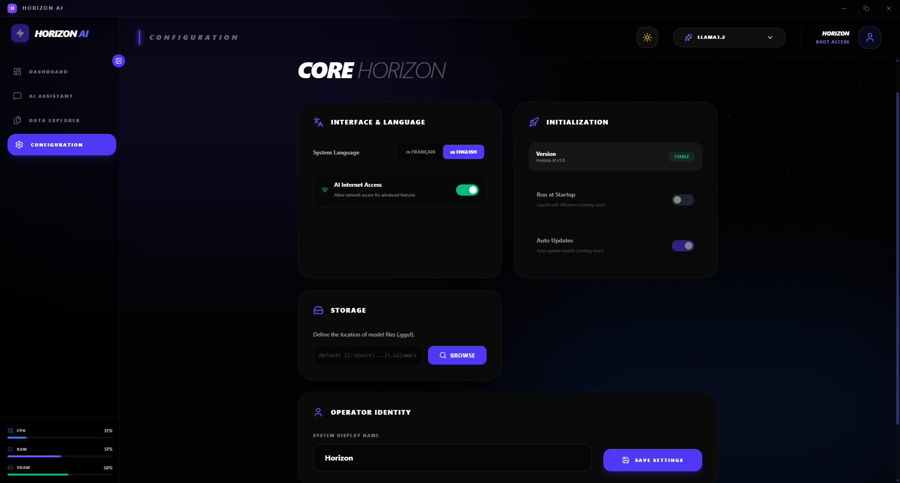

<p align="center">
  
</p>

<h1 align="center">Horizon AI</h1>

<p align="center">
  <strong>🚀 Your Private Local AI Assistant</strong>
</p>

<p align="center">
  A beautiful desktop application for running AI models locally on your computer.<br>
  100% private. No cloud. No data sent to the internet.
</p>

<p align="center">
  <a href="#-quick-install">Install</a> •
  <a href="#-features">Features</a> •
  <a href="#-screenshots">Screenshots</a> •
  <a href="#-architecture">Architecture</a> •
  <a href="#-development">Development</a>
</p>

---

## ⬇️ Quick Install

### Windows (Recommended)

**Download the installer and run it. That's all!**

📥 **[Download Horizon AI Installer (Windows x64)](https://github.com/GabrielHori/Horizon-AI/releases/latest)**

> The installer will automatically:
> - Install Horizon AI on your computer
> - Install Ollama (AI engine) silently if not present
> - Download a default AI model (~2GB)
> - Configure everything automatically

**System Requirements:**
- Windows 10/11 (64-bit)
- 8 GB RAM minimum (16 GB recommended)
- 10 GB free disk space
- NVIDIA GPU recommended (but not required)

---

## ✨ Features

### 🤖 Local AI Chat
- Chat with AI models running 100% on your computer
- Real-time streaming responses
- Conversation history with automatic saving
- Multiple AI models support

### 🔒 Complete Privacy
- **No internet required** after initial setup
- **No data sent** to external servers
- All conversations stored locally
- Full control over your data

### 🎨 Beautiful Interface
- Modern, clean design
- Dark/Light mode
- Interactive onboarding tour
- Responsive layout

### ⚡ Smart Features
- Automatic Ollama management (start/stop with app)
- GPU acceleration (NVIDIA CUDA)
- System monitoring (CPU, RAM, VRAM)
- Model management (install/delete models)

### 🌐 Remote Access (NEW!)
- Access your local AI from your phone or another computer
- Secure Cloudflare Tunnel (no port forwarding needed)
- Token-based authentication
- Rate limiting & IP allowlist
- QR code for easy mobile setup

📖 **[Full Documentation](docs/REMOTE_ACCESS.md)**

---

## 📸 Screenshots

### Dashboard
The main dashboard with quick chat, system status, and model recommendations.



---

### AI Chat
Full-featured AI chat interface with conversation history and code-friendly responses.



---

### Settings
Application configuration panel for language, storage, and system preferences.




## 🏗️ Architecture

Horizon AI is built with a modern hybrid architecture:

```
┌─────────────────────────────────────────────────────┐
│                    HORIZON AI                        │
├─────────────────────────────────────────────────────┤
│  Frontend (React + Vite)                            │
│  ├── Dashboard                                       │
│  ├── AI Chat Panel                                   │
│  ├── Settings                                        │
│  └── File Manager                                    │
├─────────────────────────────────────────────────────┤
│  Desktop Shell (Tauri / Rust)                       │
│  ├── Window Management                               │
│  ├── Ollama Installer                                │
│  ├── Python Bridge (IPC)                             │
│  └── System Integration                              │
├─────────────────────────────────────────────────────┤
│  Backend Worker (Python)                            │
│  ├── Chat History Service                            │
│  ├── Ollama Service                                  │
│  ├── GPU Monitoring                                  │
│  └── System Services                                 │
├─────────────────────────────────────────────────────┤
│  AI Engine (Ollama)                                 │
│  ├── LLaMA 3.2                                       │
│  ├── Mistral                                         │
│  ├── DeepSeek                                        │
│  └── + Many more models                              │
└─────────────────────────────────────────────────────┘
```

### Tech Stack

| Component | Technology |
|-----------|------------|
| Frontend | React 18, Vite, TailwindCSS |
| Desktop Shell | Tauri 2.0 (Rust) |
| Backend Worker | Python 3.11 (PyInstaller) |
| AI Engine | Ollama |
| IPC | JSON over stdin/stdout |

---

## 🧠 Supported AI Models

| Model | Size | Best For |
|-------|------|----------|
| llama3.2:3b | 2 GB | General use, fast responses |
| mistral | 4 GB | Balanced, versatile |
| deepseek-r1:7b | 4 GB | Reasoning, coding |
| codellama | 4 GB | Programming |
| phi | 2 GB | Lightweight, fast |
| gemma2 | 5 GB | Quality responses |

Install more models directly from the app dashboard!

---

## 💻 Development

### Prerequisites

- Node.js 18+
- Rust (latest stable)
- Python 3.11+
- Ollama installed

### Setup

```bash
# Clone the repository
git clone https://github.com/GabrielHori/Horizon-AI.git
cd Horizon-AI

# Install frontend dependencies
npm install

# Create Python virtual environment
python -m venv .venv
.venv\Scripts\activate  # Windows
# source .venv/bin/activate  # Linux/Mac

# Install Python dependencies
pip install -r worker/requirements.txt

# Run in development mode
npm run tauri dev
```

### Build for Production

```bash
# Build Python backend
pip install pyinstaller
python -m PyInstaller --clean worker/backend.spec
copy dist\backend.exe src-tauri\binaries\backend-x86_64-pc-windows-msvc.exe

# Build Tauri application
npm run tauri build
```

The installers will be generated in:
- `src-tauri/target/release/bundle/nsis/Horizon AI_1.0.0_x64-setup.exe`
- `src-tauri/target/release/bundle/msi/Horizon AI_1.0.0_x64_en-US.msi`

---

## 📁 Project Structure

```
horizon-ai/
├── src/                    # React frontend
│   ├── components/         # UI components
│   ├── pages/              # Page components
│   ├── services/           # API services
│   └── contexts/           # React contexts
├── src-tauri/              # Tauri (Rust) backend
│   ├── src/
│   │   ├── lib.rs          # Main app logic
│   │   ├── python_bridge.rs # Python IPC
│   │   └── ollama_installer.rs # Ollama management
│   └── binaries/           # Sidecar binaries
├── worker/                 # Python backend
│   ├── main.py             # Entry point
│   ├── services/           # Business logic
│   └── ipc/                # IPC handlers
└── data/                   # User data (conversations)
```

---

## 🔧 Configuration

### Environment Variables

| Variable | Description | Default |
|----------|-------------|---------|
| OLLAMA_HOST | Ollama server URL | http://localhost:11434 |
| OLLAMA_MODELS | Models storage path | System default |

### Settings (in-app)

- **Language**: French / English
- **User Name**: Your display name
- **Storage Path**: Custom Ollama models location
- **Internet Access**: Enable/disable network features

---

## 🐛 Troubleshooting

### App doesn't start
1. Make sure you have enough disk space (10 GB+)
2. Try running as Administrator
3. Check if antivirus is blocking the app

### Chat doesn't respond
1. Check if a model is selected (top bar)
2. Verify Ollama is running (green status indicator)
3. Try selecting a different model

### Slow responses
1. Close other resource-heavy applications
2. Use a smaller model (llama3.2:3b, phi)
3. If you have an NVIDIA GPU, it will be used automatically

---

## 📄 License

MIT License - See [LICENSE](LICENSE) file for details.

---

## 🙏 Credits

- [Ollama](https://ollama.ai/) - Local AI model runner
- [Tauri](https://tauri.app/) - Desktop app framework
- [React](https://react.dev/) - UI library
- [Lucide](https://lucide.dev/) - Icons

---

<p align="center">
  Made with ❤️ by <a href="https://github.com/GabrielHori">Gabriel Hori</a>
</p>

<p align="center">
  <strong>Horizon AI v1.0</strong> • Powered by Local AI ⚡
</p>
